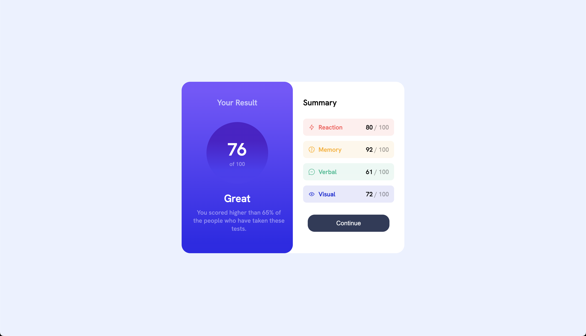
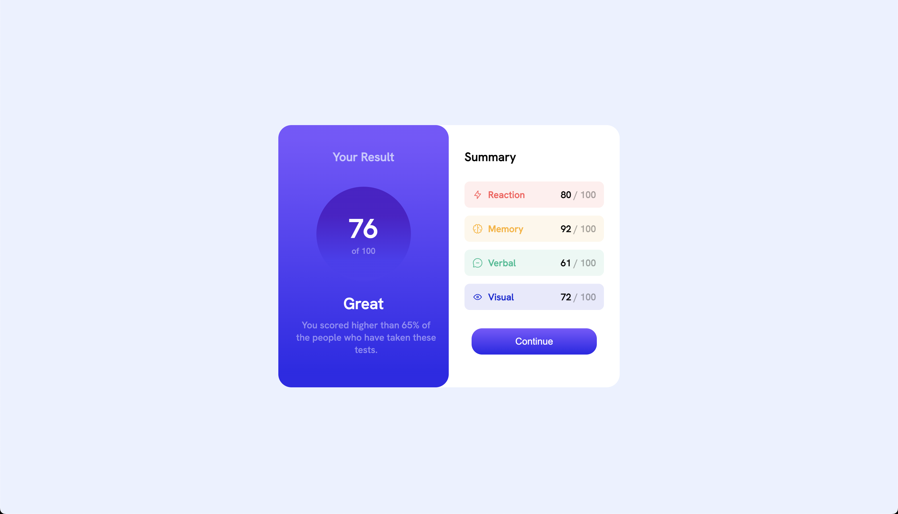
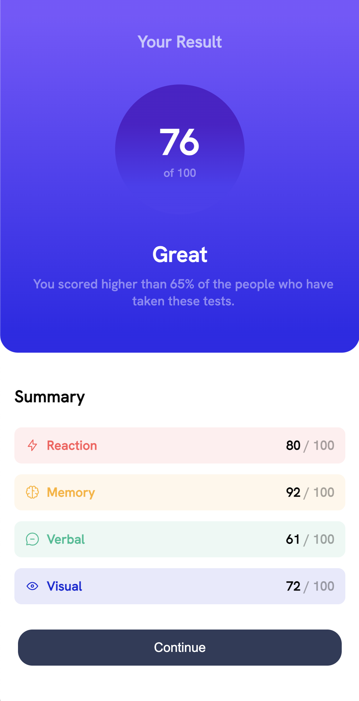

# Frontend Mentor - Results summary component solution

This is a solution to the [Results summary component challenge on Frontend Mentor](https://www.frontendmentor.io/challenges/results-summary-component-CE_K6s0maV). Frontend Mentor challenges help you improve your coding skills by building realistic projects.

## Table of contents

- [Overview](#overview)
  - [Screenshot](#screenshot)
  - [Links](#links)
- [My process](#my-process)
  - [Built with](#built-with)
- [Author](#author)

## Overview

### Screenshot

### Links

- Solution URL: [https://jakobeilts.github.io/results-frontend-mentor/](https://jakobeilts.github.io/results-frontend-mentor/)
- Live Site URL: [https://jakobeilts.github.io/results-frontend-mentor/](https://jakobeilts.github.io/results-frontend-mentor/)

## My process

### Built with

- Semantic HTML5 markup
- CSS custom properties
- Flexbox

## Author

- Website - [Jakob Eilts](https://www.jakobeilts.com)
- Frontend Mentor - [@jakobeilts](https://www.frontendmentor.io/profile/jakobeilts)
- Twitter - [@eiltsjakob](https://www.twitter.com/eiltsjakob)
